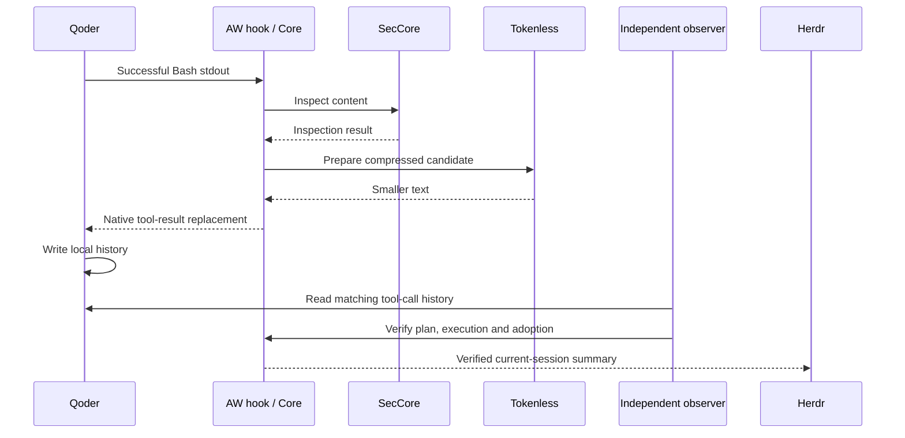

# AW meeting demo: inspection, compression and verified history adoption

[中文版](../../zh/token-saving/aw-demo.md)

Enter tasks and follow-up questions in Qoder inside a real repository while Herdr displays SecCore inspection, Tokenless compression and verified local-history adoption. After one setup, open an interactive session; a fixed synthetic demo is also available for meeting rehearsals.

This guide provides both `session.py` for real multi-turn workspace interaction and `demo.py` for a fixed single-turn demonstration on a development branch. Released components normally use `anolisa install`, with RPM also available on Alinux; this combination is not yet published through either route, so the instructions below use source. Linux ARM64 has been tested. Linux x86_64 has a pinned Herdr artifact but has not been validated live. A Qoder account with working login and model access is required.

## 1. Prepare before the meeting

Prepare Linux, Git, a C compiler, Python 3, Rust/Cargo, uv, and Qoder CLI. Downloads require access to GitHub, Rust crates, Python package sources, and Qoder. These prerequisite installation commands target Ubuntu 24.04 without an existing toolchain; skip tools already installed.

```bash
sudo apt-get update
sudo apt-get install -y build-essential pkg-config git curl ca-certificates python3
curl --proto '=https' --tlsv1.2 -sSf https://sh.rustup.rs | sh -s -- -y --default-toolchain 1.97.1 --profile minimal
curl -LsSf https://astral.sh/uv/install.sh | sh
curl -fsSL https://qoder.com/install | bash -s -- --version 1.1.47
export PATH="$HOME/.cargo/bin:$HOME/.local/bin:$PATH"
rustc --version
uv --version
qodercli --version
qodercli login
```

Rust 1.97.1 and Qoder CLI 1.1.47 are the validated versions. Setup installs Provider Python 3.11.6 separately without replacing system Python. Qoder's [official installation guide](https://docs.qoder.com/cli/installation) lists alternatives; npm requires Node.js 20 or newer and supports `npm install -g @qoder-ai/qodercli@1.1.47`.

The demo uses the current user's Qoder login in place without copying credentials. It requires empty user-level Qoder hooks and plugins. If your everyday account has integrations, sign in and run under a separate demo OS account instead of removing existing security plugins. After the first login, open `qodercli` once and exit after the normal prompt appears, ensuring `~/.qoder/settings.json` exists. This demo uses default `~/.qoder` and does not support a `QODER_CONFIG_DIR` override.

## 2. Clone, build and set up from an empty directory

Run in your chosen empty directory. No separate local Provider worktree or hand-written absolute paths are required.

```bash
git clone --single-branch --branch feat/aw/tokenless-herdr https://github.com/kongche-jbw/anolisa.git anolisa-demo
cd anolisa-demo
python3 src/aw/scripts/demo.py setup
python3 src/aw/scripts/demo.py providers
python3 src/aw/scripts/demo.py doctor
```

Setup performs these steps, each with a timeout and separate log:

1. Fetch SecCore commit `5ebfc0b3905fa2f5f74aff2da4aec2b3be639647`, checking out only the Python project containing its native Provider.
2. Install Python 3.11.6 and runtime dependencies using that commit's `uv.lock`. Only the scanner native entry point is used; the SecCore daemon is neither built nor installed.
3. Build Tokenless 0.8.0 and `aw-hook-cli`, `aw-view-cli`, `aw-adoption-cli`, and `cosh-shell` from this clone.
4. Download unmodified Herdr v0.9.0, verify its pinned SHA-256, and retain its license.
5. Check Provider imports, versions, protocols, and build artifacts.

Generated content stays in `src/aw/target/demo/`: `sec-core/` contains pinned source and venv, `python/` and `uv-cache/` contain Python tooling, `build/` contains Rust outputs, `herdr/` contains the panel, `setup-logs/` contains build logs, and `runs/` contains demo evidence. Repeating setup reuses dependencies and incremental builds. Modified SecCore source or a mismatched Herdr digest fails with the affected path.

Doctor also checks Qoder version, login state, and integration conflicts without making a model request. The live rehearsal confirms model access. Both rehearsal and presentation call a real model and may incur account usage.

## 3. Interact freely in a real repository

Start the repository’s `cosh` entry from the clone root. It runs the Rust `cosh-shell` built by setup. The installed Node.js `cosh` is a different entry; the temporary PATH below selects this clone without replacing installed files. Ordinary commands stay in the original shell; Herdr starts only when you type an agent command.

```bash
AW_CHECKOUT="$PWD"
export PATH="$AW_CHECKOUT/src/aw/scripts:$PATH"
cosh --allow-unrecoverable
```

At the cosh prompt, run ordinary commands first, then enter Qoder:

```bash
pwd
git status --short
qoder
```

Exit Qoder/Herdr with `Ctrl+B`, then `q`. You return to the same cosh shell, preserving its current directory and variables. Run `pwd` again or type `codex` to attach another native Herdr terminal. Codex uses the installed CLI and existing login, with native hooks configured for this invocation to connect SecCore. On first use, trust the AW hooks in Codex `/hooks`; Tokenless output replacement remains Qoder-only. Native agent arguments follow the command normally, for example `qoder --model auto` or `codex --help`. Avoid aliasing these names in Bash startup files. `--shell zsh` is not supported by this Bash integration.

Qoder opens in the selected directory. The native Herdr client inherits the current terminal and handles keyboard input and resizing itself. The launcher manages process lifecycles without reading or forwarding keys. Enter tasks and follow-up questions, scroll, cancel generation and confirm permissions normally. The launcher sends no prompt and creates no fixture. It does not modify repository source, the Git branch, or existing configuration files; actual development operations you authorize Qoder to perform can still change the project. You decide any initial directory-trust prompt; the launcher does not accept it automatically.

Try this sequence in the ANOLISA repository:

1. Ask: “First use Bash to inspect Git status and the main source directories. Explain the modules without changing files.”
2. Follow up: “Use Bash to run `cargo metadata --manifest-path src/tokenless/Cargo.toml --no-deps --format-version 1` and analyze Tokenless crate dependencies.”
3. Ask a real follow-up, such as: “Which layer selects the compressor? Read the code and explain the call path.”
4. Watch Herdr cumulative calls, `history adopted`, and saved bytes. Not every output compresses; short output, unsupported formats, and failed commands do not count as savings.

The `scripts/cosh` launcher exports Bash functions for `qoder`, `qodercli`, and `codex` only to its own cosh process tree. Agent children have those exported functions removed to prevent recursive attachment. No startup file is changed. To leave cosh, type `exit` after leaving Herdr. In the parent shell, remove the temporary PATH entry:

```bash
export PATH="${PATH#"$AW_CHECKOUT/src/aw/scripts:"}"
hash -r
```


The sidebar uses explicit high-contrast text, separating Bash result counts, SecCore/Tokenless versions, per-Provider calls, latest results, and independently verified history adoption and saved bytes. One Bash result can invoke two Providers; their summed invocation count is no longer presented as Bash activity.

Press `Ctrl+B`, release, then press `p` to open the **AW PROVIDERS** popup. Press `1` for actual executable paths, SecCore source directory, native protocols, configured/executed versions, manifest digests and cumulative statistics. Press `2` for the latest 40 Provider calls: tool IDs, outcomes, elapsed time, source/candidate bytes and actual compression operations. Click Overview, Recent calls, or Close; use the wheel or arrow keys to scroll. Native Herdr sidebar selection, divider dragging, and right-click menus remain available when the outer terminal supports mouse events.

Herdr’s top-level agent `blocked` state means the agent is waiting; it is not a SecCore rejection. Assess scanner activity using the separate inspection result and findings.

A native Tokenless `no_savings` result displays `preserved: no savings`; timeouts display failure codes. Older evidence without native reasons explicitly says `native reason not recorded`, rather than guessing from `bypassed`. Details come only from events verified by Rust for the current session. Verification errors or session changes clear previous details. Source paths and Provider results remain local.

AW currently handles the main Agent's Bash post-tool output. Other tools, including Read and Edit, remain available normally in Qoder, while the sidebar labels its coverage `Bash only`. Bash failures, native capture size-limit failures, and unverifiable results appear as `unverified` without increasing adopted savings. Results awaiting permission confirmation or native history persistence show `pending` and do not count as adopted. SecCore performs post-tool content inspection here, not pre-command enforcement or OS protection.

Ordinary follow-up questions retain cumulative session counts. To start from zero, exit and run the launcher again. Pinned Herdr v0.9.0 cannot replace Qoder session identity. If you use `/new` or switch native sessions inside Qoder, AW clears stale sidebar statistics and asks you to restart; subsequent tools in that process retain native behavior without AW inspection or compression. Previous evidence remains. The default deadline is one hour; direct invocation with `session.py --duration 7200 --allow-unrecoverable` selects two hours, with a supported range of 60–14400 seconds.

To exit, press `Ctrl+B`, release, then press `q`. This ends the Qoder, observer, and Herdr processes managed by this entry point. In a single-pane session, agent exit returns to cosh. Once you have additional panes, exiting one agent leaves the other panes running; `Ctrl+B q` ends the whole instance. Native Qoder history, project changes, and trust settings you chose to save remain. Startup and exit print `src/aw/target/sessions/<UUID>/`, a 0700 AW evidence directory containing this session's original Bash output, adoption records, and logs; retain it according to the actual data requirements. Removing one AW evidence directory neither deletes Qoder history nor rolls back code.

```bash
rm -rf -- "$AW_CHECKOUT/src/aw/target/sessions/<UUID>"
```

`--workspace` defaults to the current directory. `--provider-dir` defaults to the AW clone's `src/aw/providers/` and can select another explicit trusted manifest directory. User/project hook and plugin coexistence is not validated; configured hooks or installed Qoder plugins cause an explicit startup failure. The launcher uses default `~/.qoder` login configuration and does not support `QODER_CONFIG_DIR`. Resuming old sessions, subagents, custom cwd changes, and other native tool projections remain outside this binding contract; failed binding preserves native behavior and reports unverified results.

The multi-turn entry point uses `scripts/session.py` to launch Herdr/Qoder. `session_hooks.py` generates launcher turn identities from native `UserPromptSubmit` events and snapshots each tool's turn at `PreToolUse`; `PostToolUse` invokes the same Rust `aw-hook-cli`. Independent process `session_observer.py` waits for complete history lines, verifies with `aw-adoption-cli` and `aw-view-cli`, then publishes counters. Verification runs independently of native Herdr input. Providers, AW Core, and Schema use the setup implementations, and this runtime path does not import test runners. Native event references: [Qoder hooks](https://docs.qoder.com/cli/hooks).

### Independent Qoder sessions in split panes

After starting a fresh Herdr instance through cosh, press `Ctrl+B`, release, then `v` for side-by-side panes or `-` for stacked panes. The pane border context menu also offers **Split right** and **Split down**. Enter `qoder` or `qodercli` at the new pane’s shell prompt. Each invocation discovers the configured Providers, creates private hook settings and evidence, and starts its own observer. Sidebar statistics belong to that pane’s Agent. `Ctrl+B p` opens details for the focused pane. Closing the first Qoder leaves the second running; restarting Qoder in a pane creates fresh statistics.

The instance uses a private Bash rc file that sources your normal `~/.bashrc` before defining these commands; it does not modify user startup files. Agent subprocesses do not inherit the entry functions. Calling the agent executable by absolute path bypasses this integration. Codex panes independently connect SecCore and explicitly mark Tokenless replacement unsupported. A shared instance retains the original startup deadline and explicit output-replacement consent.

Existing Herdr instances keep their old shell configuration. Save ongoing work, leave the old instance, then start the updated entry; already running Agents are not retrofitted.

### Demonstrate that SecCore detects sensitive content

Inside Qoder, ask it to execute exactly the following command using Bash and report any hook warning. The value is a nonfunctional synthetic credential. Keep this as the last call while presenting the latest-result panel.

```bash
printf 'api_key=sk-abcdefghijklmnopqrstuvwxyz123456\n'
```

Open `Ctrl+B p` and select Recent calls. The verified native run reports `inspection: sensitive`, rule `api_key`, count `1`, severity `high`, and `Scanned: 43/43 B | complete: True`. Overview shows the actual SecCore executable and source path. A clean comparison is `printf 'version=1\n'`, which reports `clean`. These are post-tool observations: the command ran, and the original output is retained. This demonstrates scanner detection, not command blocking, output redaction, or OS isolation. Qoder also receives the native hook warning. Local `provider-details.json` and `evidence/` preserve the corresponding receipt and findings.

### Codex inspection and first-use trust

Type `codex` at the cosh prompt, then `/hooks` inside Codex. Trust the `SessionStart` and `PostToolUse` entries whose command points to this clone's `src/aw/scripts/codex_hooks.py`. The launcher adds invocation-local hook configuration without rewriting user or project Codex configuration files. Codex persists your trust choice through its native UI; see the [Codex hooks documentation](https://learn.chatgpt.com/docs/hooks). The launcher does not bypass hook trust.

Startup `Provider installed (not a call)` only confirms local programs are available. Until a native hook arrives, the sidebar says `waiting for Codex hook`. After trusting, run a shell task to obtain actual results. If `SessionStart` was skipped before trust, the first `PostToolUse` can still bind the native session. `Ctrl+B p` shows the focused pane's actual Provider path, version, rules, scanned bytes and invocation ID.

To demonstrate scanning of tool output, create a temporary synthetic file in cosh before entering Codex. Put only the file path in your prompt so the sample content is not sent directly to the model beforehand:

```bash
AW_SAMPLE_DIR="$(mktemp -d /tmp/aw-sec-demo.XXXXXX)"
printf 'api_key=sk-abcdefghijklmnopqrstuvwxyz123456\n' > "$AW_SAMPLE_DIR/credential.env"
printf '%s\n' "$AW_SAMPLE_DIR/credential.env"
codex
```

After trusting via `/hooks`, ask Codex: “Use the shell to execute `cat <the full file path printed above>`.” Expect one additional SecCore call, `sensitive`, and `1 findings`. Details show `rule_id=api_key`, `severity=high`, and complete scanning of 44 B. This proves **post-tool content detection**: the command has run and its original output is retained. A detection warning does not prove redaction or leakage prevention. Codex explicitly shows Tokenless as `unsupported adapter`, without fabricated compression or adoption statistics.

Back in cosh, remove the sample:

```bash
rm -rf -- "$AW_SAMPLE_DIR"
```

Each new pane's `codex` invocation has a separate runtime binding, evidence and observer. Follow-ups accumulate within that session. After switching native sessions inside Codex, exit and launch `codex` again to avoid reusing stale statistics. Remote Codex and changing the workspace with `--cd` are outside this attachment contract. This entry requires a Codex CLI supporting these native hooks and `/hooks`; successful model login alone does not establish hook support.

## 4. Rehearse and present a fixed scenario

First run the complete rehearsal. Even with `--headless`, the compressed case starts real Qoder and Herdr and verifies actual TUI content; it simply does not mirror the screen to your terminal.

```bash
python3 src/aw/scripts/demo.py run --headless --allow-unrecoverable
```

For the meeting, use a terminal of at least 120 columns by 40 rows and run:

```bash
python3 src/aw/scripts/demo.py run --allow-unrecoverable --hold-seconds 30
```

The terminal shows Qoder inside the real Herdr TUI. The script trusts only its newly created synthetic workspace and submits a prompt that executes `cat fixture.json` once. After verification, the sidebar remains visible for 30 seconds, then the demo exits and cleans up. No prompt entry is needed; this is an automated single-turn demonstration, not a general multi-turn chat launcher. `--allow-unrecoverable` explicitly permits replacing the synthetic tool result.

Suggested presentation order, taking approximately three minutes:

| Stage | Screen or action | Talking point |
| --- | --- | --- |
| Before launch | `providers` lists two Providers | Configuration files manage installation paths and are discovered by default; hooks need no manual paths |
| Tool execution | Qoder runs `cat fixture.json` once | The Agent uses its native tool; a post-tool hook passes the result to AW |
| Inspection and compression | SecCore and Tokenless sidebar rows | AW executes inspection and compression in a plan, recording each Provider result |
| Adoption confirmation | `history adopted` and negative byte count | An independent observer checks Qoder local history; generating a candidate alone does not count as savings |
| After exit | `Demo passed` and evidence path | Every run has its own session, records, and cleanup results for inspection |

The historical baseline is 4459 B → 3107 B, saving 1352 B with one adoption. Use the current run's output as evidence. These are bytes, not model Tokens or billing amounts. `history adopted` means local-history adoption and does not claim remote model consumption. SecCore performs content inspection here, not OS isolation or a pre-execution block.

Implementation flow:



## 5. No-gain and failure demonstrations

These supplementary cases use non-interactive Qoder and print results without starting combined Herdr acceptance. Each run creates a fresh directory automatically.

```bash
python3 src/aw/scripts/demo.py run --headless --allow-unrecoverable --case no-gain
python3 src/aw/scripts/demo.py run --headless --allow-unrecoverable --case provider-failure
```

No-gain preserves the original with zero adoptions and savings. Provider-failure exits Tokenless before compression and must show a failed Receipt, Core preserve, the original result, and zero savings. The demonstration exposes failure handling rather than counting failure as successful optimization.

## 6. Provider placement and discovery

The default directory is `src/aw/providers/*.json`, independent of the command's working directory. One `sec-core` and one `tokenless` are currently supported and selected by ID; directory order does not change Core execution order. Missing or duplicate IDs and unsupported kinds, versions, or protocols fail explicitly. `providers` only reads configuration; `doctor` checks and executes version/import probes.

| Field | Meaning |
| --- | --- |
| `id` | Currently `sec-core` or `tokenless` |
| `kind` | `security` or `projection`, respectively |
| `version` | Currently `0.11.0` or `0.8.0`, respectively |
| `native_protocol` | `1` or `2`, respectively; distinct from AW capability Schema versions |
| `program` | Executable path, absolute or relative to its manifest |
| `source` | SecCore Python source directory, also resolved relative to its manifest |

Place both manifests in another trusted directory and select it with global option `--provider-dir /absolute/providers` before `providers`, `doctor`, or `run`. Do not recursively discover and execute programs from Agent workspaces. Setup always prepares the default repository layout and does not install dependencies for custom manifests.

Discovery belongs to this demo launcher. After reading files, it still generates explicit, pinned Provider invocation settings for the existing Host. It is not a general Provider installer or a Core hot-loading protocol and does not install native plugins automatically.

## 7. Troubleshooting, evidence and cleanup

| Symptom | Action |
| --- | --- |
| Setup fails | Open the printed `setup-logs/step-*.log`, fix network/build dependencies and rerun; the old system Tokenless is never selected automatically |
| Qoder version mismatch | Prepare 1.1.47 in the demo account; the demo project disables automatic updates without changing global user settings |
| Login or model failure | Run `qodercli login`, verify interactive Qoder works, and rerun; doctor cannot guarantee model request success |
| User hook/plugin conflict | Use a separate demo account; existing integrations are not automatically disabled |
| Non-terminal environment | Use `demo.py run --headless` for the fixed demo; `session.py` requires a real terminal |
| Interactive statistics unverified | Inspect `target/sessions/<UUID>/errors/`, `calls/*/hook.stderr.log`, `calls/*/verification-error.log` and `herdr.log`; tools outside coverage do not count toward savings |
| Demo fails | Inspect `herdr/command.log`, `agent/result.json`, and `agent/lifecycle.json` under the printed directory; failed runs are not successful evidence |

The following evidence and automatic deletion rules apply to fixed `demo.py run` scenarios. For real `session.py` retention, see section 3.

For fixed compression, `herdr/result.json` must report `passed`, `real_sidebar_render: passed`, and positive `saved_bytes`. `agent/adoption-verified.json` and `agent/evidence/` retain adoption and execution evidence. `herdr/screen.ansi` captures actual screen output; it is not interactive playback or a video recording.

At the end of each run, the launcher stops its Qoder, Herdr client, and server, removing its temporary home, dedicated Qoder session, and newly added trust entry. Ctrl+C also follows cleanup. Interrupted setup stops its process group and retains logs and incremental build materials. After forced SIGKILL or a machine crash, inspect recorded PIDs and generations before using the exact stop commands in `launcher.json`, `agent/lifecycle.json`, and `herdr/ownership.json` to handle leftovers.

Logs and evidence are intentionally retained. Each successful run prints the exact command to delete its records. Once all demo builds, caches, and evidence can be discarded, remove local demo materials from the repository root:

```bash
rm -rf -- src/aw/target/demo
```

This does not uninstall prerequisite Rust, uv, or Qoder or remove account credentials. See [implementation and reproduction](../../../../src/aw/docs/design/tokenless-herdr-acceptance.md) for the evidence contract and earlier acceptance results.
