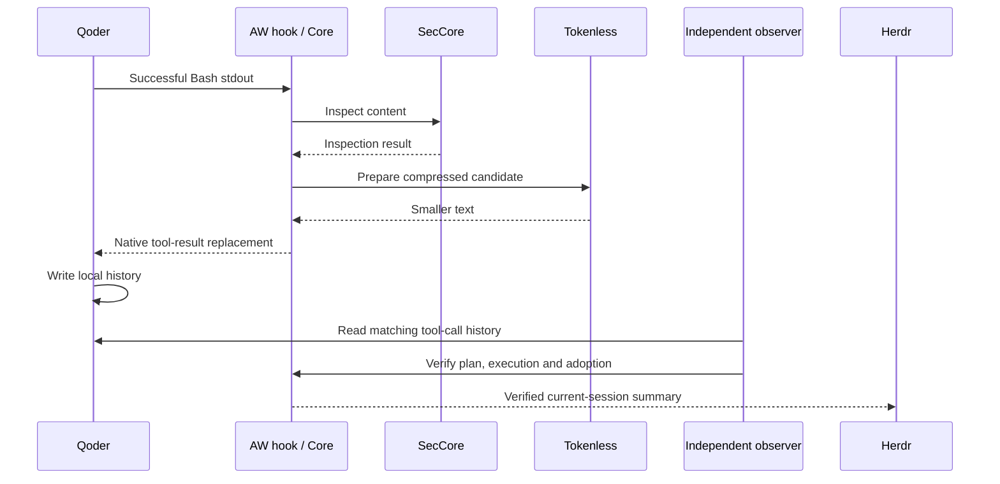

# AW meeting demo: inspection, compression and verified history adoption

[中文版](../../zh/token-saving/aw-demo.md)

Use one launch command to show Qoder reading synthetic JSON, SecCore inspection, Tokenless compression, and Herdr displaying savings actually adopted in the current session. The launcher prepares Provider paths, installs a project hook, submits a fixed prompt, and cleans up the demo session for rehearsals and presentations.

This is a single-turn demonstration on a development branch. Released components normally use `anolisa install`, with RPM also available on Alinux; this combination is not yet published through either route, so the instructions below use source. Linux ARM64 has been tested. Linux x86_64 has a pinned Herdr artifact but has not been validated live. A Qoder account with working login and model access is required.

## 1. Prepare before the meeting

Prepare Linux, Git, a C compiler, Python 3, Rust/Cargo, uv, and Qoder CLI. Downloads require access to GitHub, Rust crates, Python package sources, and Qoder. These prerequisite installation commands target Ubuntu 24.04 without an existing toolchain; skip tools already installed.

```bash
sudo apt-get update
sudo apt-get install -y build-essential pkg-config git curl ca-certificates python3
curl --proto '=https' --tlsv1.2 -sSf https://sh.rustup.rs | sh -s -- -y --default-toolchain 1.97.1 --profile minimal
curl -LsSf https://astral.sh/uv/install.sh | sh
curl -fsSL https://qoder.com/install | bash -s -- --version 1.1.47
export PATH="$HOME/.cargo/bin:$HOME/.local/bin:$PATH"
rustc --version
uv --version
qodercli --version
qodercli login
```

Rust 1.97.1 and Qoder CLI 1.1.47 are the validated versions. Setup installs Provider Python 3.11.6 separately without replacing system Python. Qoder's [official installation guide](https://docs.qoder.com/cli/installation) lists alternatives; npm requires Node.js 20 or newer and supports `npm install -g @qoder-ai/qodercli@1.1.47`.

The demo uses the current user's Qoder login in place without copying credentials. It requires empty user-level Qoder hooks and plugins. If your everyday account has integrations, sign in and run under a separate demo OS account instead of removing existing security plugins. After the first login, open `qodercli` once and exit after the normal prompt appears, ensuring `~/.qoder/settings.json` exists. This demo uses default `~/.qoder` and does not support a `QODER_CONFIG_DIR` override.

## 2. Clone, build and set up from an empty directory

Run in your chosen empty directory. No separate local Provider worktree or hand-written absolute paths are required.

```bash
git clone --single-branch --branch feat/aw/tokenless-herdr https://github.com/kongche-jbw/anolisa.git anolisa-demo
cd anolisa-demo
python3 src/aw/scripts/demo.py setup
python3 src/aw/scripts/demo.py providers
python3 src/aw/scripts/demo.py doctor
```

Setup performs these steps, each with a timeout and separate log:

1. Fetch SecCore commit `5ebfc0b3905fa2f5f74aff2da4aec2b3be639647`, checking out only the Python project containing its native Provider.
2. Install Python 3.11.6 and runtime dependencies using that commit's `uv.lock`. Only the scanner native entry point is used; the SecCore daemon is neither built nor installed.
3. Build Tokenless 0.8.0 and `aw-hook-cli`, `aw-view-cli`, and `aw-adoption-cli` from this clone.
4. Download unmodified Herdr v0.9.0, verify its pinned SHA-256, and retain its license.
5. Check Provider imports, versions, protocols, and build artifacts.

Generated content stays in `src/aw/target/demo/`: `sec-core/` contains pinned source and venv, `python/` and `uv-cache/` contain Python tooling, `build/` contains Rust outputs, `herdr/` contains the panel, `setup-logs/` contains build logs, and `runs/` contains demo evidence. Repeating setup reuses dependencies and incremental builds. Modified SecCore source or a mismatched Herdr digest fails with the affected path.

Doctor also checks Qoder version, login state, and integration conflicts without making a model request. The live rehearsal confirms model access. Both rehearsal and presentation call a real model and may incur account usage.

## 3. Rehearse and present

First run the complete rehearsal. Even with `--headless`, the compressed case starts real Qoder and Herdr and verifies actual TUI content; it simply does not mirror the screen to your terminal.

```bash
python3 src/aw/scripts/demo.py run --headless --allow-unrecoverable
```

For the meeting, use a terminal of at least 120 columns by 40 rows and run:

```bash
python3 src/aw/scripts/demo.py run --allow-unrecoverable --hold-seconds 30
```

The terminal shows Qoder inside the real Herdr TUI. The script trusts only its newly created synthetic workspace and submits a prompt that executes `cat fixture.json` once. After verification, the sidebar remains visible for 30 seconds, then the demo exits and cleans up. No prompt entry is needed; this is an automated single-turn demonstration, not a general multi-turn chat launcher. `--allow-unrecoverable` explicitly permits replacing the synthetic tool result.

Suggested presentation order, taking approximately three minutes:

| Stage | Screen or action | Talking point |
| --- | --- | --- |
| Before launch | `providers` lists two Providers | Configuration files manage installation paths and are discovered by default; hooks need no manual paths |
| Tool execution | Qoder runs `cat fixture.json` once | The Agent uses its native tool; a post-tool hook passes the result to AW |
| Inspection and compression | SecCore and Tokenless sidebar rows | AW executes inspection and compression in a plan, recording each Provider result |
| Adoption confirmation | `history adopted` and negative byte count | An independent observer checks Qoder local history; generating a candidate alone does not count as savings |
| After exit | `Demo passed` and evidence path | Every run has its own session, records, and cleanup results for inspection |

The historical baseline is 4459 B → 3107 B, saving 1352 B with one adoption. Use the current run's output as evidence. These are bytes, not model Tokens or billing amounts. `history adopted` means local-history adoption and does not claim remote model consumption. SecCore performs content inspection here, not OS isolation or a pre-execution block.

Implementation flow:



## 4. No-gain and failure demonstrations

These supplementary cases use non-interactive Qoder and print results without starting combined Herdr acceptance. Each run creates a fresh directory automatically.

```bash
python3 src/aw/scripts/demo.py run --headless --allow-unrecoverable --case no-gain
python3 src/aw/scripts/demo.py run --headless --allow-unrecoverable --case provider-failure
```

No-gain preserves the original with zero adoptions and savings. Provider-failure exits Tokenless before compression and must show a failed Receipt, Core preserve, the original result, and zero savings. The demonstration exposes failure handling rather than counting failure as successful optimization.

## 5. Provider placement and discovery

The default directory is `src/aw/providers/*.json`, independent of the command's working directory. One `sec-core` and one `tokenless` are currently supported and selected by ID; directory order does not change Core execution order. Missing or duplicate IDs and unsupported kinds, versions, or protocols fail explicitly. `providers` only reads configuration; `doctor` checks and executes version/import probes.

| Field | Meaning |
| --- | --- |
| `id` | Currently `sec-core` or `tokenless` |
| `kind` | `security` or `projection`, respectively |
| `version` | Currently `0.11.0` or `0.8.0`, respectively |
| `native_protocol` | `1` or `2`, respectively; distinct from AW capability Schema versions |
| `program` | Executable path, absolute or relative to its manifest |
| `source` | SecCore Python source directory, also resolved relative to its manifest |

Place both manifests in another trusted directory and select it with global option `--provider-dir /absolute/providers` before `providers`, `doctor`, or `run`. Do not recursively discover and execute programs from Agent workspaces. Setup always prepares the default repository layout and does not install dependencies for custom manifests.

Discovery belongs to this demo launcher. After reading files, it still generates explicit, pinned Provider invocation settings for the existing Host. It is not a general Provider installer or a Core hot-loading protocol and does not install native plugins automatically.

## 6. Troubleshooting, evidence and cleanup

| Symptom | Action |
| --- | --- |
| Setup fails | Open the printed `setup-logs/step-*.log`, fix network/build dependencies and rerun; the old system Tokenless is never selected automatically |
| Qoder version mismatch | Prepare 1.1.47 in the demo account; the demo project disables automatic updates without changing global user settings |
| Login or model failure | Run `qodercli login`, verify interactive Qoder works, and rerun; doctor cannot guarantee model request success |
| User hook/plugin conflict | Use a separate demo account; existing integrations are not automatically disabled |
| Non-terminal environment | Use `--headless`; presentation requires a real terminal |
| Demo fails | Inspect `herdr/command.log`, `agent/result.json`, and `agent/lifecycle.json` under the printed directory; failed runs are not successful evidence |

For compression, `herdr/result.json` must report `passed`, `real_sidebar_render: passed`, and positive `saved_bytes`. `agent/adoption-verified.json` and `agent/evidence/` retain adoption and execution evidence. `herdr/screen.ansi` captures actual screen output; it is not interactive playback or a video recording.

At the end of each run, the launcher stops its Qoder, Herdr client, and server, removing its temporary home, dedicated Qoder session, and newly added trust entry. Ctrl+C also follows cleanup. Interrupted setup stops its process group and retains logs and incremental build materials. After forced SIGKILL or a machine crash, inspect recorded PIDs and generations before using the exact stop commands in `launcher.json`, `agent/lifecycle.json`, and `herdr/ownership.json` to handle leftovers.

Logs and evidence are intentionally retained. Each successful run prints the exact command to delete its records. Once all demo builds, caches, and evidence can be discarded, remove local demo materials from the repository root:

```bash
rm -rf -- src/aw/target/demo
```

This does not uninstall prerequisite Rust, uv, or Qoder or remove account credentials. See [implementation and reproduction](../../../../src/aw/docs/design/tokenless-herdr-acceptance.md) for the evidence contract and earlier acceptance results.
