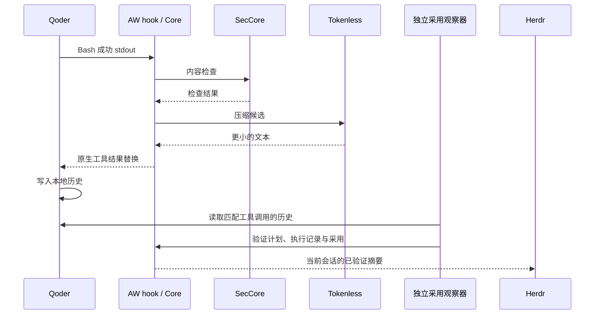

# AW 组会演示：检查、压缩与已验证的历史采用

[English](../../en/token-saving/aw-demo.md)

用一条启动命令展示 Qoder 读取合成 JSON、SecCore 检查、Tokenless 压缩，以及 Herdr 显示当前会话实际采用的节省。脚本自动准备 Provider 路径、启动项目 hook、提交固定提示词并清理演示会话，适合会前彩排和现场讲解。

这是开发分支的单轮演示入口。发布版通常通过 `anolisa install` 安装组件，Alinux 也可使用 RPM；本组合尚未发布到这两条安装路径，下面使用源码分支。Linux ARM64 已实测；Linux x86_64 有固定 Herdr 制品，但尚未实机验收。需要可登录且能调用模型的 Qoder 账号。

## 1. 会前准备

准备 Linux、Git、C 编译器、Python 3、Rust/Cargo、uv 和 Qoder CLI。下载阶段需要访问 GitHub、Rust crates、Python 包源和 Qoder。以下基础软件安装步骤仅适用于尚未配置工具链的 Ubuntu 24.04；已有工具可跳过，不需要重装。

```bash
sudo apt-get update
sudo apt-get install -y build-essential pkg-config git curl ca-certificates python3
curl --proto '=https' --tlsv1.2 -sSf https://sh.rustup.rs | sh -s -- -y --default-toolchain 1.97.1 --profile minimal
curl -LsSf https://astral.sh/uv/install.sh | sh
curl -fsSL https://qoder.com/install | bash -s -- --version 1.1.47
export PATH="$HOME/.cargo/bin:$HOME/.local/bin:$PATH"
rustc --version
uv --version
qodercli --version
qodercli login
```

Rust 1.97.1、Qoder CLI 1.1.47 是本次验收版本；Provider 的 Python 3.11.6 由 setup 独立安装，无需替换系统 Python。Qoder 的[官方安装说明](https://docs.qoder.com/cli/installation)提供其他安装方式；使用 npm 时要求 Node.js 20 及以上，可执行 `npm install -g @qoder-ai/qodercli@1.1.47`。

沿用当前用户的 Qoder 登录，不复制认证。当前入口要求用户级 Qoder hooks 和 plugins 为空；如日常账号装有集成，请在独立演示 OS 账号登录并运行，不要为演示卸载日常安全插件。首次登录后运行一次 `qodercli`，看到正常输入界面后退出，确保 `~/.qoder/settings.json` 已建立。演示使用默认 `~/.qoder`，不支持 `QODER_CONFIG_DIR` 覆盖。

## 2. 从空目录 clone、编译和 setup

在你选定的空目录执行下列命令。无需另一个本地 Provider 工作树，也无需填写绝对路径。

```bash
git clone --single-branch --branch feat/aw/tokenless-herdr https://github.com/kongche-jbw/anolisa.git anolisa-demo
cd anolisa-demo
python3 src/aw/scripts/demo.py setup
python3 src/aw/scripts/demo.py providers
python3 src/aw/scripts/demo.py doctor
```

`setup` 完成以下步骤，每步有超时和独立日志：

1. 获取 SecCore 提交 `5ebfc0b3905fa2f5f74aff2da4aec2b3be639647`，只展开原生 Provider 所在的 Python 项目。
2. 用该提交的 `uv.lock` 安装 Python 3.11.6 及运行依赖。只使用 scanner 原生入口，不构建或安装 SecCore 守护进程。
3. 从本次 clone 编译 Tokenless 0.8.0，以及 `aw-hook-cli`、`aw-view-cli`、`aw-adoption-cli`。
4. 下载未修改的 Herdr v0.9.0 并校验固定 SHA-256，保留上游许可证。
5. 核验 Provider 导入、版本、协议与构建产物。

生成内容集中在 `src/aw/target/demo/`：`sec-core/` 是固定源码与 venv，`python/` 与 `uv-cache/` 是 Python 工具缓存，`build/` 是 Rust 产物，`herdr/` 是面板，`setup-logs/` 是构建日志，`runs/` 是每次演示证据。再次执行 setup 会复用依赖并增量构建；发现 SecCore 已修改或 Herdr 摘要不匹配时失败并指出路径。

`doctor` 还会检查 Qoder 版本、登录状态和集成冲突，但不发起模型请求。模型访问是否可用由下一步真实彩排确认。彩排与正式演示都调用真实模型，可能产生账号用量。

## 3. 彩排与现场演示

先做一次完整彩排；即使使用 `--headless`，压缩场景仍会启动真实 Qoder 和 Herdr，并验证实际 TUI 内容，只是不把画面输出到当前终端。

```bash
python3 src/aw/scripts/demo.py run --headless --allow-unrecoverable
```

现场将终端设为至少 120 列 × 40 行，然后执行：

```bash
python3 src/aw/scripts/demo.py run --allow-unrecoverable --hold-seconds 30
```

会显示真实 Herdr TUI 内的 Qoder。脚本自动信任本次新建的合成工作目录，提交只执行 `cat fixture.json` 的提示词。验证完成后侧栏保持 30 秒供讲解，然后退出并清理。无需手动输入提示词；这是自动单轮演示，不是任意多轮聊天入口。`--allow-unrecoverable` 显式允许替换本次合成工具结果。

建议按下面的顺序讲解，总计约三分钟：

| 阶段 | 画面或操作 | 可讲的内容 |
| --- | --- | --- |
| 启动前 | `providers` 列出两个 Provider | 安装路径由配置文件管理，启动时默认发现；无需给每个 hook 拼路径 |
| 执行工具 | Qoder 执行一次 `cat fixture.json` | Agent 使用原生工具，后置 hook 把结果交给 AW |
| 检查与压缩 | SecCore、Tokenless 侧栏 | AW 按计划执行检查与压缩，记录各 Provider 的执行结果 |
| 采用确认 | `history adopted` 和负的字节数 | 独立观察器核对 Qoder 本地历史；候选生成后还需要采用确认才累计节省 |
| 退出后 | `Demo passed` 和证据路径 | 每次演示有独立会话、记录和清理结果，可以复核 |

历史基线为 4459 B → 3107 B，节省 1352 B，采用 1 次。以当次输出为准；这里统计字节，不是模型 Token 或账单金额。`history adopted` 表示本地历史采用，不宣称远端模型已经消费。SecCore 此处执行内容检查，不代表 OS 隔离或前置阻断。

实现流程：



## 4. 无收益与故障演示

这两个补充场景运行非交互 Qoder，在终端输出结果，不启动 Herdr 组合验收。每次自动生成新目录，不需要手工改路径。

```bash
python3 src/aw/scripts/demo.py run --headless --allow-unrecoverable --case no-gain
python3 src/aw/scripts/demo.py run --headless --allow-unrecoverable --case provider-failure
```

`no-gain` 应保留原文，采用与节省均为零。`provider-failure` 让 Tokenless 在压缩前退出，应出现 failed Receipt、Core preserve、原文保留和零节省。这里演示的是可观察的失败处理，不是把失败计为优化成功。

## 5. Provider 放置与发现规则

默认读取 `src/aw/providers/*.json`，与运行命令时所在目录无关。当前支持一个 `sec-core` 和一个 `tokenless`，按 ID 选择，目录顺序不改变 Core 的执行顺序。缺失、重复 ID、不支持的种类、版本或协议都会显式失败。`providers` 仅读取配置；`doctor` 才检查并执行版本/导入探测。

| 字段 | 含义 |
| --- | --- |
| `id` | 当前固定为 `sec-core` 或 `tokenless` |
| `kind` | 分别为 `security`、`projection` |
| `version` | 当前分别为 `0.11.0`、`0.8.0` |
| `native_protocol` | 分别为 `1`、`2`；不等于 AW 能力 Schema 版本 |
| `program` | 可执行文件，绝对路径或相对当前 manifest 的路径 |
| `source` | 仅 SecCore 使用的 Python 源码目录，同样相对 manifest 解析 |

可以把两个 manifest 放到自己信任的目录，用全局参数 `--provider-dir /absolute/providers` 选择，再执行 `providers`、`doctor` 或 `run`。不要从 Agent 的工作目录自动递归发现并执行程序。`setup` 始终准备仓库默认布局，不替自定义 manifest 安装依赖。

发现功能属于本次演示启动器；读取文件后仍会生成显式、固定的 Provider 调用配置交给现有 Host。它不是通用 Provider 安装器或 Core 的热加载协议，不会自动安装原生插件。

## 6. 排障、证据与清理

| 症状 | 处理 |
| --- | --- |
| setup 失败 | 打开输出中的 `setup-logs/step-*.log`，解决网络/编译依赖后重跑；不会自动切换系统旧版 Tokenless |
| Qoder 版本不符 | 在演示账号准备 1.1.47；演示项目禁用自动更新，不修改用户全局设置 |
| 登录或模型失败 | `qodercli login` 后确认交互 Qoder 可正常使用，再重新运行；doctor 不保证模型请求成功 |
| 用户 hook/plugin 冲突 | 使用独立演示账号；脚本不会自动关闭现有集成 |
| 非终端环境 | 使用 `--headless`；现场展示需要真实终端 |
| 演示失败 | 查看所打印目录的 `herdr/command.log`、`agent/result.json` 和 `agent/lifecycle.json`，不要将失败目录当作成功证据 |

压缩场景的 `herdr/result.json` 应为 `passed`，并包含 `real_sidebar_render: passed`、正的 `saved_bytes`。`agent/adoption-verified.json` 与 `agent/evidence/` 保留采用和执行证据；`herdr/screen.ansi` 保存实际画面输出。它是终端捕获文件，不是交互式回放或录屏视频。

每次 `run` 结束时停止自己创建的 Qoder、Herdr 客户端和服务，删除临时 home、专属 Qoder 会话和本次添加的信任条目。按 Ctrl+C 提前结束也走清理路径。中断 setup 会停止它自己的进程组，保留日志和增量构建材料。若进程被强制 SIGKILL 或机器断电，则需检查记录中的 PID 与代次，再使用 `launcher.json`、`agent/lifecycle.json`、`herdr/ownership.json` 的准确停止命令处理残留。

日志和证据有意保留。每次成功退出都会打印删除该次记录的精确命令。确认无需保留任何演示构建、缓存和证据后，在仓库根目录清理全部本地演示材料：

```bash
rm -rf -- src/aw/target/demo
```

此命令不卸载会前安装的 Rust、uv、Qoder，也不删除账号认证。详细的证据合同和早期验收记录见[实现与复现说明](../../../../src/aw/docs/design/tokenless-herdr-acceptance_zh.md)。
