# PR 3 Schema 参考与语义讨论

本文面向第一次接触 AW Provider 的研发、测试和架构评审人员。图中保留完整字段，正文只
解释字段组的职责、当前合理的设计和接口冻结前需要讨论的问题。

审查基线为 `8574ecb022ec9ffc68e1a71e30f2186b6ec81674`，PR 头提交为
`42d07649409ecd5bb023056b28545efbd9325ef2`。

## 1. 先看整体关系

本 PR 涉及 22 个物理 JSON Schema 文件。8 份 AW canonical Schema 在 Provider 包中各有
一份逐字节副本。按内容和语义去重后，共有 14 份逻辑 Schema。

一次 Provider 调用会经过两套合同。

```text
COSH 事件
  → AW Hook 生成 canonical input
  → Provider Host 按 provider.toml 生成 native request
  → 组件返回 native response
  → Provider Host 生成 canonical output 和 receipt
  → AW Core 校验并交给 COSH 作最终决定
```

| 合同层 | 维护方 | 解决的问题 |
| --- | --- | --- |
| AW canonical | AW 团队 | 跨组件统一能力名称、输入和输出语义 |
| Provider native | 组件团队 | 保留 Tokenless 或 Agent Sec 自己的进程协议 |
| manifest mapping | Provider 接入方 | 声明 canonical 字段怎样变成 native 字段 |

这三层分工合理。Provider Host 可以执行通用映射，无需为每个组件增加专用代码。Schema
仍需和 Rust 类型、Python model、manifest 以及真实进程输出一起冻结。只审查 JSON 文件
无法发现所有语义漂移。

## 2. 十四份 Schema 快速索引

| 逻辑 Schema | 类型 | 主要用途 |
| --- | --- | --- |
| `context.projection.prepare.input/v1` | AW canonical | 提交即将进入模型的 Tool Result |
| `context.projection.prepare.output/v1` | AW canonical | 返回可供选择的上下文候选内容 |
| `security.content.inspect.input/v1` | AW canonical | 提交模型可见内容进行敏感信息扫描 |
| `security.content.inspect.output/v1` | AW canonical | 返回内容扫描摘要 |
| `security.code.inspect.input/v1` | AW canonical | 提交代码文本和语言假设 |
| `security.code.inspect.output/v1` | AW canonical | 返回代码风险和实际分析语言 |
| `security.command.inspect.input/v1` | AW canonical | 提交执行前命令进行门禁检查 |
| `security.command.inspect.output/v1` | AW canonical | 返回 allow、warn 或 deny 意见 |
| `agent-sec-aw-provider-request/v1` | Provider native | 调用 Agent Sec 的三个扫描入口 |
| `agent-sec-aw-provider-response/v1` | Provider native | 返回 Agent Sec 扫描状态和结果 |
| `tokenless-compression-request/v1` | Provider native | 调用 Tokenless 压缩正文 |
| `tokenless-compression-response/v1` | Provider native | 返回压缩候选和 token 估算 |
| `skill-ledger-analyze/v1` | 关联变更 | 描述 Agent Sec Skill Ledger 分析结果 |
| `cosh-ng-e2e-result` | 关联变更 | 描述 COSH-NG E2E 测试结果 |

后两份 Schema 不参与 AW Provider 发现和调用。本 PR 只修改了它们的 `$id` 域名。

## 3. 阅读 Schema 时先找四类字段

| 字段类别 | 常见字段 | 阅读重点 |
| --- | --- | --- |
| 身份 | `id`、`source_artifact_id`、`tool_use_id` | 结果是否对应同一份输入和同一次调用 |
| 正文与摘要 | `content`、`digest`、`scanned_bytes` | 处理、扫描和最终执行的字节是否一致 |
| 状态 | `disposition`、`verdict`、`truncated` | 进程状态、业务判断和最终动作是否分层 |
| 审计 | `rule_id`、`transform_chain`、meters | 是否能说明过程，同时避免复制正文 |

JSON Schema 擅长检查字段形状。它不能独自证明 `digest` 确实来自 `content`，也不能证明
Provider 检查的命令就是系统随后执行的命令。这类跨字段和跨组件事实需要代码与
conformance tests 保证。

## 4. AW canonical Schema

### 4.1 Context Projection 输入

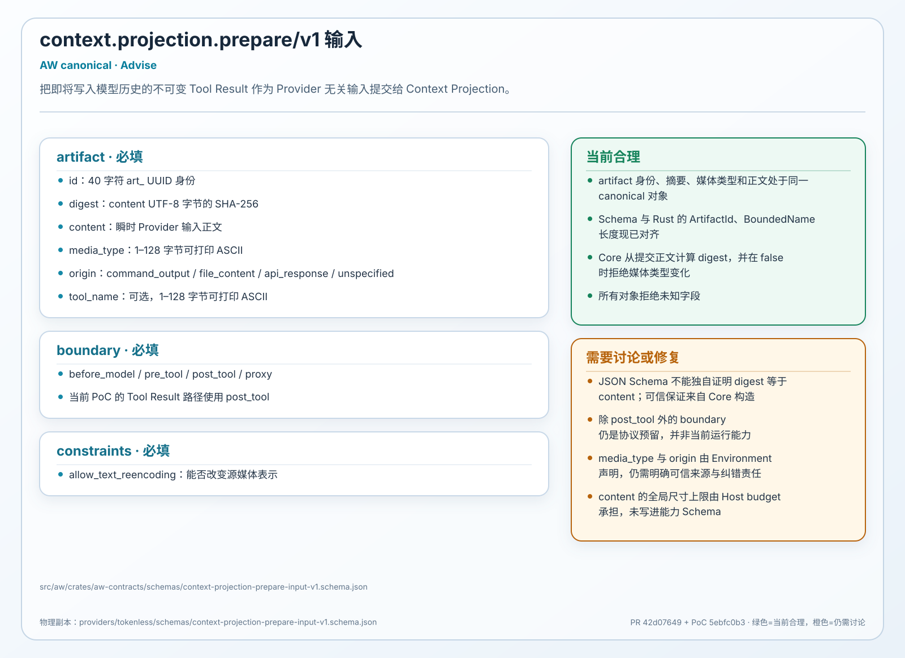

| 字段组 | 语义 |
| --- | --- |
| `artifact` | 保存输入身份、摘要、正文、媒体类型和来源 |
| `boundary` | 标明能力发生在 `post_tool` 等 Agent 边界 |
| `constraints` | 声明是否允许把结构化内容改成文本表示 |

**当前合理**

身份、摘要和正文放在同一对象中，Provider 不需要理解 COSH 私有事件格式。

**需要讨论**

`tool_name` 的 Schema 上限按字符计算，Rust 类型按 128 UTF-8 bytes 计算。Digest 的计算
字节域也需要写进合同。当前 Core 只产生 `post_tool`，其他 boundary 应标明实现状态。

### 4.2 Context Projection 输出

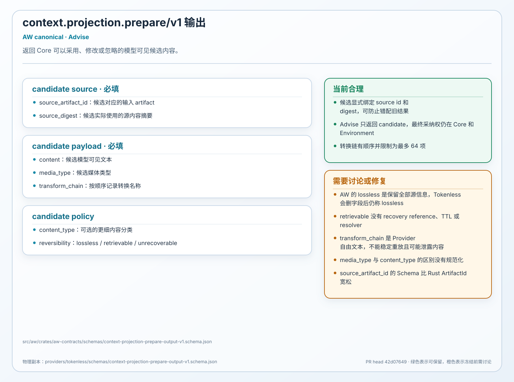

| 字段组 | 语义 |
| --- | --- |
| source identity | `source_artifact_id` 和 `source_digest` 绑定原输入 |
| candidate payload | `content` 和 `media_type` 是建议进入模型的内容 |
| transformation | `transform_chain` 和 `reversibility` 描述转换方式 |

**当前合理**

输出叫 candidate，Environment 仍拥有最终采用权。Source identity 可以阻止旧结果或错源
结果被采用。

**需要讨论**

AW 的 `lossless` 表示保留全部源信息。Tokenless 删除 `debug`、`trace` 或空字段后仍可能
使用同名状态。Provider adapter 需要按 AW 的强定义转换。`retrievable` 还缺少 recovery
reference、有效期和 resolver 合同。

### 4.3 Content Inspect 输入

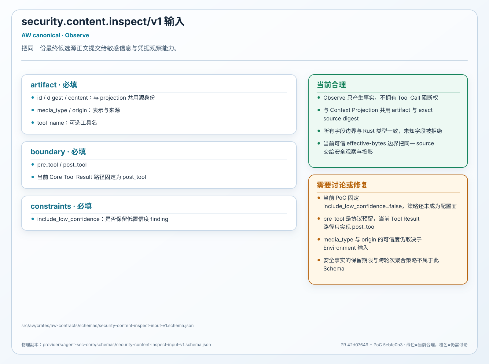

| 字段组 | 语义 |
| --- | --- |
| `artifact` | 提供被扫描正文及其身份和摘要 |
| `boundary` | 说明正文来自 Tool 执行前或执行后 |
| `include_low_confidence` | 决定是否保留低置信度 finding |

**当前合理**

Observe 只报告事实，不直接决定是否阻断。输入复用了 Context Projection 的 artifact 语义。

**需要讨论**

当前 COSH 先脱敏 HookInput，AW 扫描的正文可能和最终入模正文不同。Schema 与 digest 需要
绑定同一份最终可见字节。

### 4.4 Content Inspect 输出

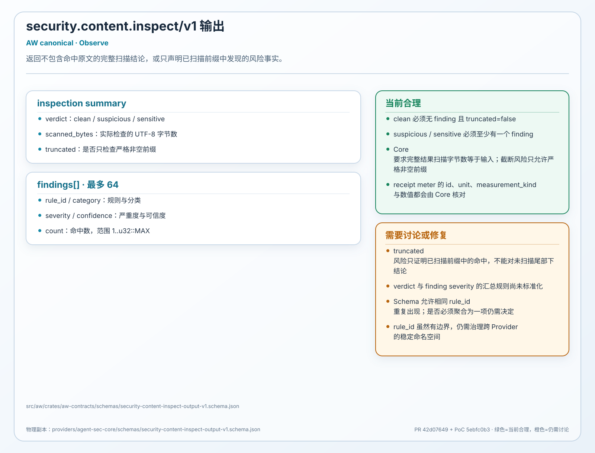

| 字段组 | 语义 |
| --- | --- |
| inspection summary | `verdict`、`scanned_bytes` 和 `truncated` 描述覆盖情况 |
| `findings[]` | 返回规则、类别、严重性、置信度和计数 |

**当前合理**

Finding 不返回命中原文和偏移，降低了日志和 Ledger 再次泄露内容的风险。

**需要讨论**

Schema 允许 `clean` 与 critical finding 同时出现，也允许 `truncated=true` 后仍返回 clean。
建议增加 `indeterminate` 状态，并让 `count` 从 1 开始。

### 4.5 Code Inspect 输入

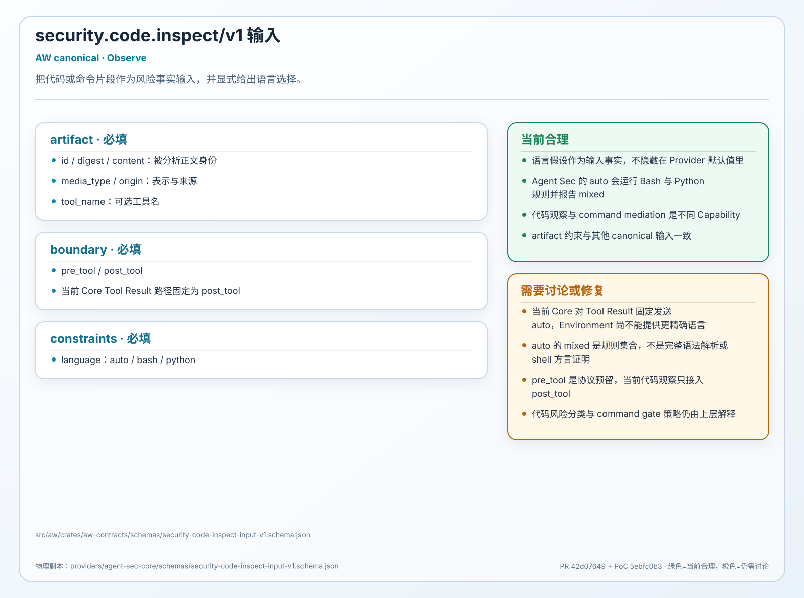

| 字段组 | 语义 |
| --- | --- |
| `artifact` | 提供代码文本和 source identity |
| `boundary` | 标明代码出现的 Agent 边界 |
| `language` | 选择 `auto`、`bash` 或 `python` 扫描方式 |

**当前合理**

语言假设进入公共合同，调用方可以知道扫描器采用了哪一类规则。

**需要讨论**

当前 Agent Sec 只在显式 `python` 时使用 Python 规则，`auto` 会走 Bash 扫描。Core 又固定
发送 `auto`。v1 可以要求上游明确语言，也可以定义检测、双扫描和 unknown 降级规则。

### 4.6 Code Inspect 输出

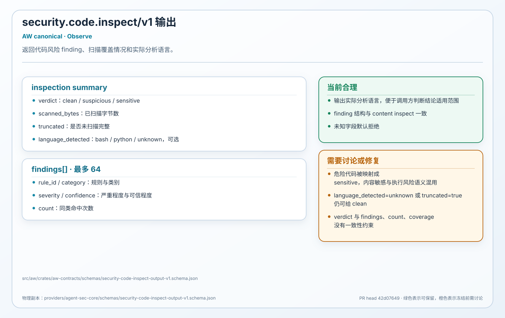

| 字段组 | 语义 |
| --- | --- |
| inspection summary | 返回 verdict、扫描字节、截断状态和实际语言 |
| `findings[]` | 使用与 Content Inspect 相同的 finding 结构 |

**当前合理**

`language_detected` 让调用方能够判断结论适用于哪种语言。

**需要讨论**

`language_detected=unknown` 或 `truncated=true` 时仍可返回 clean。危险代码还被归入
`sensitive`，混合了内容敏感和执行风险两种语义。

### 4.7 Command Inspect 输入

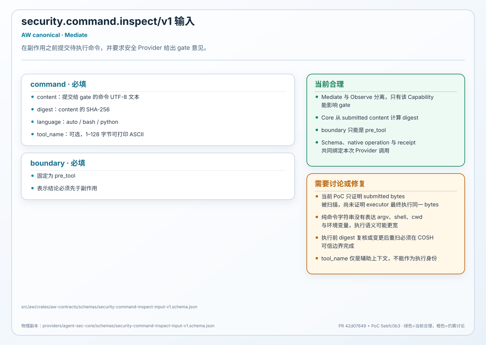

| 字段组 | 语义 |
| --- | --- |
| `command` | 保存将要执行的命令、摘要、语言和工具名 |
| `boundary` | 固定为 `pre_tool` |

**当前合理**

Mediate 与 Observe 分成不同 Capability。命令和 digest 同时存在，便于建立审计引用。

**需要讨论**

Schema 无法证明此命令就是 COSH 最终执行的命令。全部 Hook patch 聚合后，需要再次校验
`digest(scanned_command) == digest(executed_command)`。

### 4.8 Command Inspect 输出

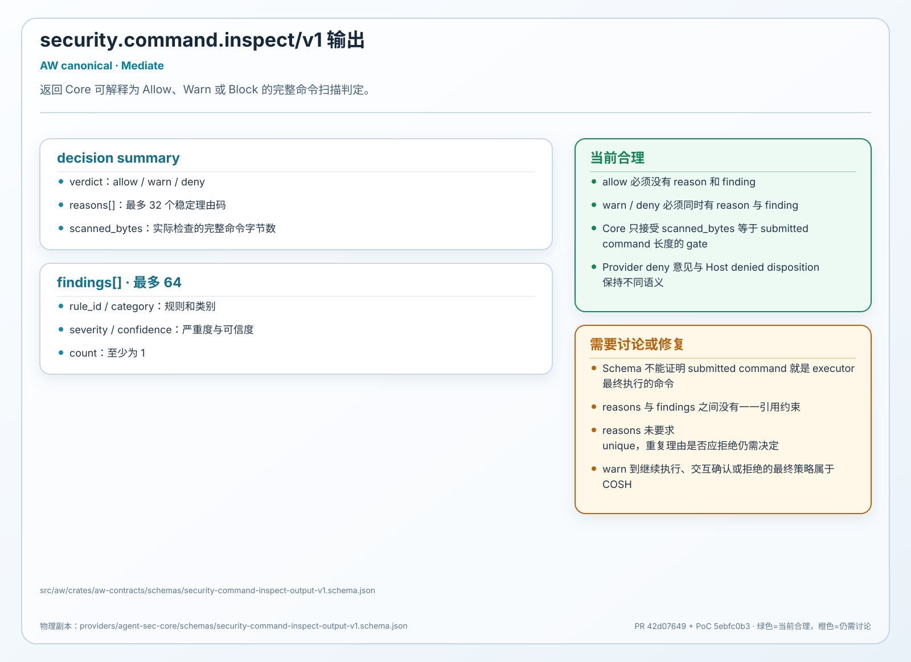

| 字段组 | 语义 |
| --- | --- |
| decision summary | `verdict`、`reasons` 和 `scanned_bytes` 表达门禁意见 |
| `findings[]` | 提供决定所依据的规则事实 |

**当前合理**

`allow`、`warn` 和 `deny` 是封闭枚举，Core 可以稳定映射为门禁状态。

**需要讨论**

当前允许 allow 携带 critical finding，也允许 deny 没有 reason。输出还缺少 `truncated`、
coverage 和 detected language，调用方无法确认 allow 是否来自完整扫描。

## 5. Provider native Schema

### 5.1 Agent Sec native request

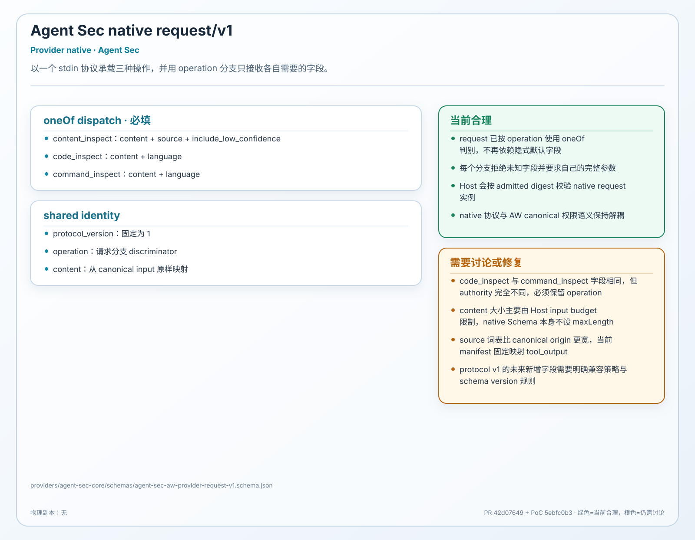

`operation` 在同一进程入口选择 content、code 或 command 扫描，`content` 是实际扫描文本，
其余字段提供语言和低置信度策略。

单一入口便于复用现有 Python scanner。当前 Schema 没有按 operation 要求对应字段。
`command_inspect` 缺少 language 仍可通过，应改为判别联合或拆成三个 endpoint。

### 5.2 Agent Sec native response

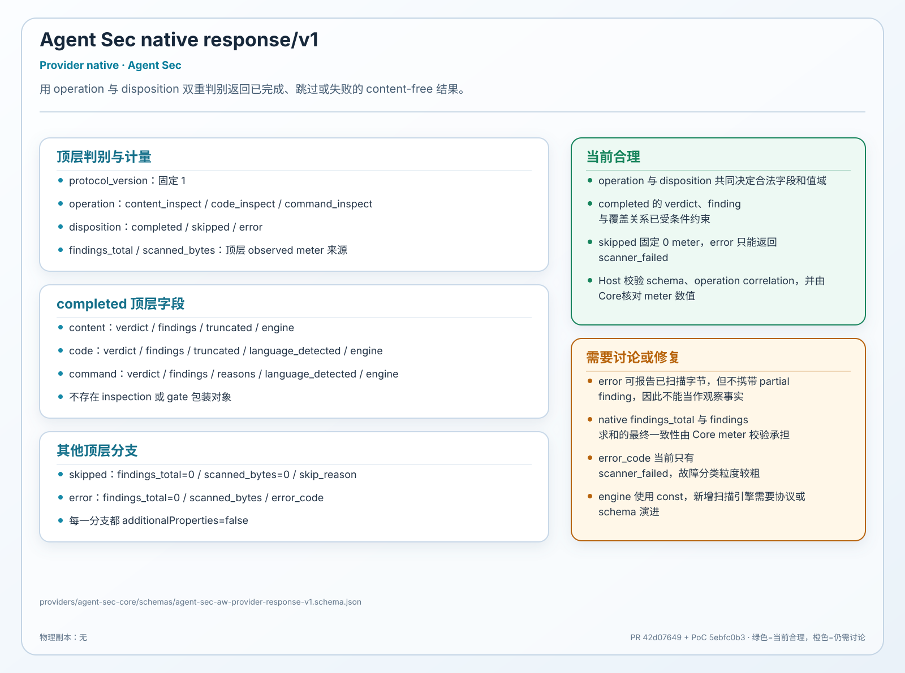

`disposition` 描述进程是否完成，`verdict` 和 findings 描述扫描结论，计数字段供 Host 生成
meters。统一 envelope 可以服务三项 Capability。

当前 verdict 是多种操作的联合枚举。Content scan 可以返回 `allow`，`completed` 也可以
缺少 verdict。响应应回显 operation，并按 operation 与 disposition 限制字段组合。

### 5.3 Tokenless CompressionRequest

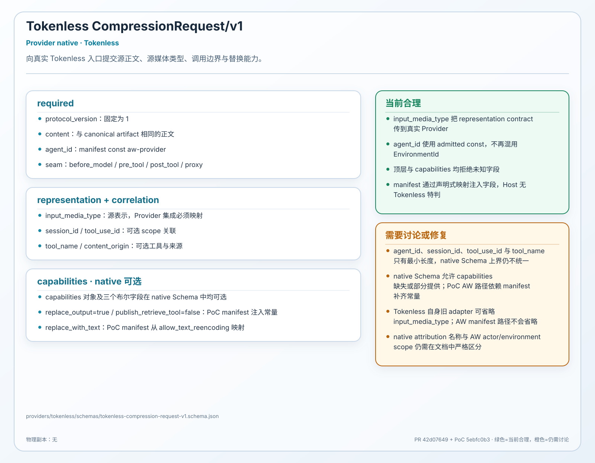

`content` 是待压缩正文，`seam` 说明调用边界，`capabilities` 说明是否允许替换、恢复工具
和文本重编码。Host 通过 manifest 填充这些字段。

当前 `additionalProperties=true`，多个字符串缺少上限。AW 的 environment instance id 被
映射到 Tokenless 的 `agent_id`，而后者原义是稳定 frontend 名称。两个概念需要分开。

### 5.4 Tokenless CompressionResponse

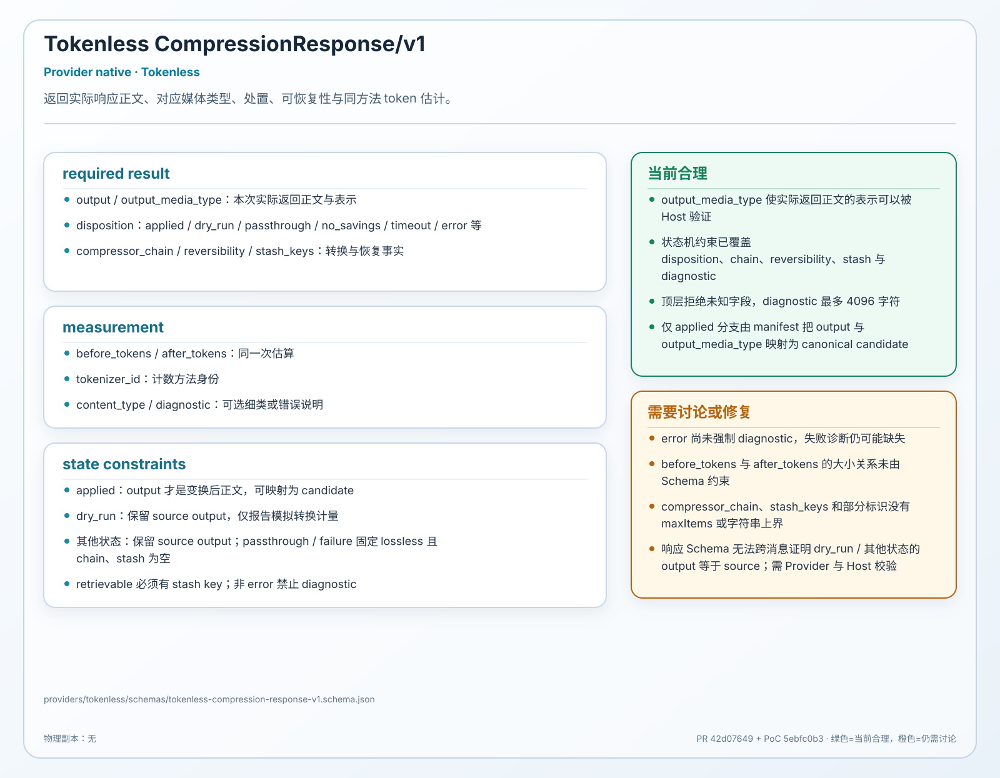

`disposition` 说明是否应用压缩，`output` 是候选正文，token 字段记录估算，转换链与
stash 字段描述可恢复性。

Schema 尚未表达 `applied`、output、diagnostic 和 stash 之间的状态关系。最先需要解决的
仍是 `lossless` 语义转换，避免不可逆删字段结果满足 AW 的强保证。

## 6. 关联但不参与 Provider 的 Schema

### 6.1 Skill Ledger analyze result

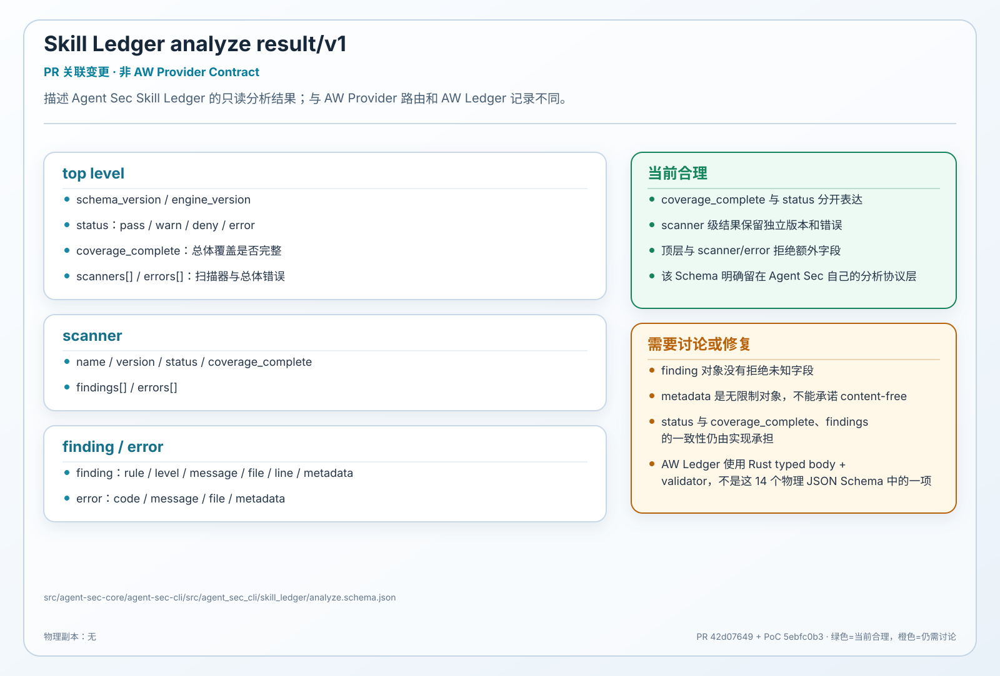

该 Schema 描述 Agent Sec Skill Ledger 的离线分析结果。它的 `coverage_complete` 值得安全
Capability 借鉴。Finding 中的 `metadata` 是无约束对象，不能直接用于要求 content-free
的 AW receipt 或 Ledger。

### 6.2 COSH-NG E2E result

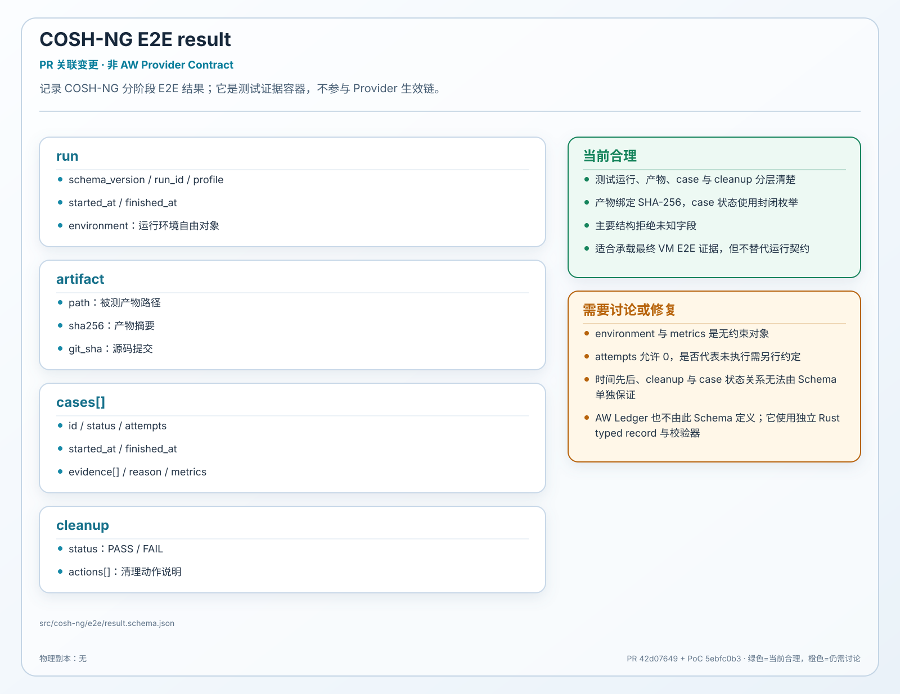

该 Schema 记录测试运行、产物摘要、case 结果和 cleanup 状态。结构与产物 SHA-256 设计
清楚。`environment` 和 `metrics` 是无约束对象，时间先后与 cleanup 状态仍需代码验证。

## 7. 接口冻结前的六项讨论

| 主题 | 当前问题 | 建议方向 |
| --- | --- | --- |
| 输入字节域 | 扫描正文可能和最终入模或执行正文不同 | 用同一个 digest 贯穿扫描、采用和执行 |
| `lossless` | AW 与 Tokenless 使用同名但保证强度不同 | 保留 AW 强定义，由 adapter 严格转换 |
| 语言与覆盖 | `auto`、unknown 和 truncated 可产生过强结论 | 明确检测方式，并引入 indeterminate |
| 状态组合 | verdict、finding、reason 和 disposition 可互相矛盾 | 使用判别联合与 typed cross-field validation |
| 字符与字节限制 | JSON Schema 和 Rust 类型采用不同计数规则 | 统一词法、长度单位和专用 ID 类型 |
| 运行时校验 | Host 校验 Schema 文件及摘要，不校验 payload 实例 | 缓存 validator 并校验四个数据阶段 |

四个数据阶段指 canonical input、native request、native response 和 canonical output。
Provider 控制的 `rule_id`、media type、transform id 与 method 也应使用受限类型，避免这些
字段成为 Receipt 或 Ledger 的自由文本通道。

## 8. 建议的修复顺序

1. 先冻结 `lossless`、coverage、truncated、indeterminate 和 digest 字节域。
2. 为每项 Capability 写状态表，列出合法和非法字段组合。
3. 用同一组 conformance vectors 验证 Schema、Rust 类型、Python model 和 Provider copy。
4. 在 Host 中增加四阶段 instance validation，并让 Core 校验跨字段不变量。
5. 运行真实 COSH、Host、Provider binary 和 Ledger 的端到端测试。

这套顺序以公共语义为起点。Schema 可以继续作为改造中心，但每次修改都要同步类型、
mapping、实现和测试，避免文件已经一致而运行语义仍然分叉。

## 9. 物理文件与图册维护

| 文件类别 | 数量 | 说明 |
| --- | --- | --- |
| `aw-contracts` canonical | 8 | AW 权威定义 |
| Provider 包 canonical 副本 | 8 | 与权威文件逐字节一致 |
| Provider native | 4 | Tokenless 和 Agent Sec 各一对 |
| 关联变更 | 2 | 只修改 `$id`，不参与 Provider |

<details>
<summary>展开 22 个物理文件路径</summary>

AW canonical 权威文件

1. `src/aw/crates/aw-contracts/schemas/context-projection-prepare-input-v1.schema.json`
2. `src/aw/crates/aw-contracts/schemas/context-projection-prepare-output-v1.schema.json`
3. `src/aw/crates/aw-contracts/schemas/security-content-inspect-input-v1.schema.json`
4. `src/aw/crates/aw-contracts/schemas/security-content-inspect-output-v1.schema.json`
5. `src/aw/crates/aw-contracts/schemas/security-code-inspect-input-v1.schema.json`
6. `src/aw/crates/aw-contracts/schemas/security-code-inspect-output-v1.schema.json`
7. `src/aw/crates/aw-contracts/schemas/security-command-inspect-input-v1.schema.json`
8. `src/aw/crates/aw-contracts/schemas/security-command-inspect-output-v1.schema.json`

Provider 包中的 canonical 副本

1. `providers/tokenless/schemas/context-projection-prepare-input-v1.schema.json`
2. `providers/tokenless/schemas/context-projection-prepare-output-v1.schema.json`
3. `providers/agent-sec-core/schemas/security-content-inspect-input-v1.schema.json`
4. `providers/agent-sec-core/schemas/security-content-inspect-output-v1.schema.json`
5. `providers/agent-sec-core/schemas/security-code-inspect-input-v1.schema.json`
6. `providers/agent-sec-core/schemas/security-code-inspect-output-v1.schema.json`
7. `providers/agent-sec-core/schemas/security-command-inspect-input-v1.schema.json`
8. `providers/agent-sec-core/schemas/security-command-inspect-output-v1.schema.json`

Provider native 文件

1. `providers/tokenless/schemas/tokenless-compression-request-v1.schema.json`
2. `providers/tokenless/schemas/tokenless-compression-response-v1.schema.json`
3. `providers/agent-sec-core/schemas/agent-sec-aw-provider-request-v1.schema.json`
4. `providers/agent-sec-core/schemas/agent-sec-aw-provider-response-v1.schema.json`

关联变更文件

1. `src/agent-sec-core/agent-sec-cli/src/agent_sec_cli/skill_ledger/analyze.schema.json`
2. `src/cosh-ng/e2e/result.schema.json`

</details>

仓库另有未被本 PR 修改的 `website/agent-index/schema.json`，不计入上述 22 个文件。

14 张 SVG 由 `diagram-sources/schema-catalog.json` 和
`diagram-sources/render-schema-diagrams.mjs` 确定性生成。修改 Schema 后应重新生成图册，
并检查 canonical 副本、manifest digest 与 source file 是否仍然一致。
